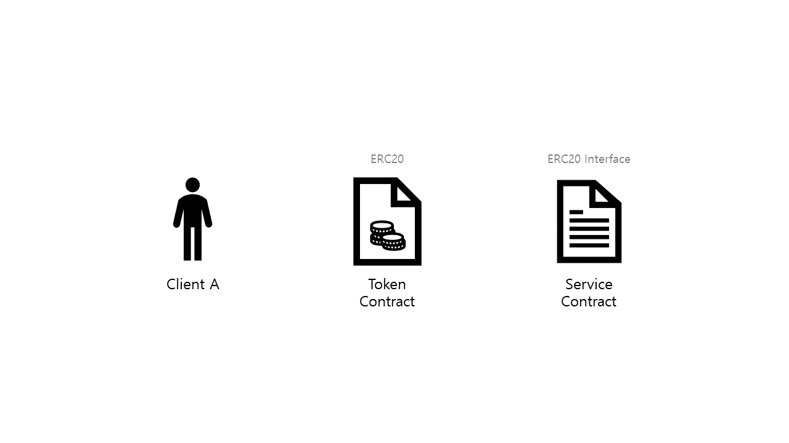
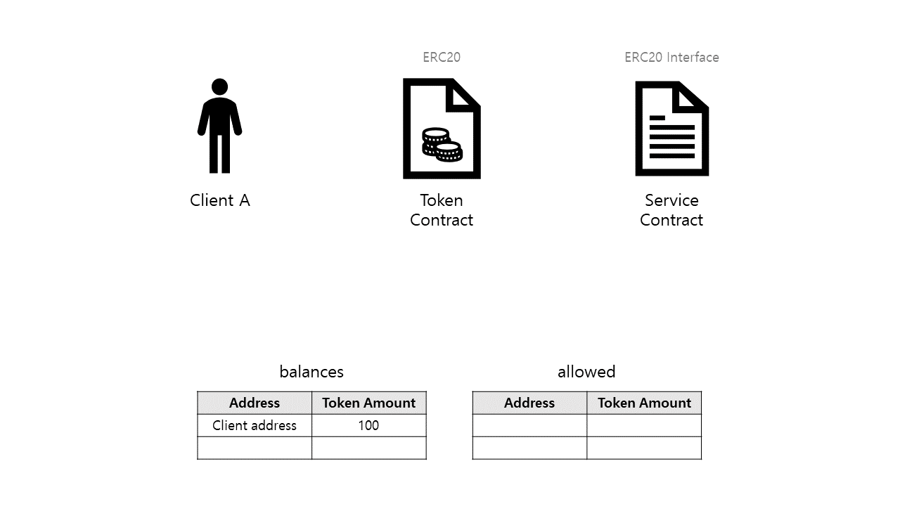
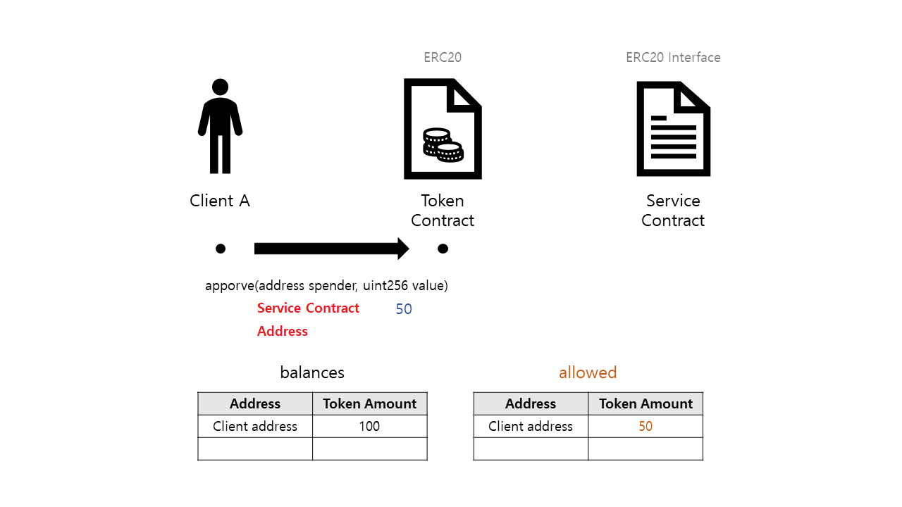
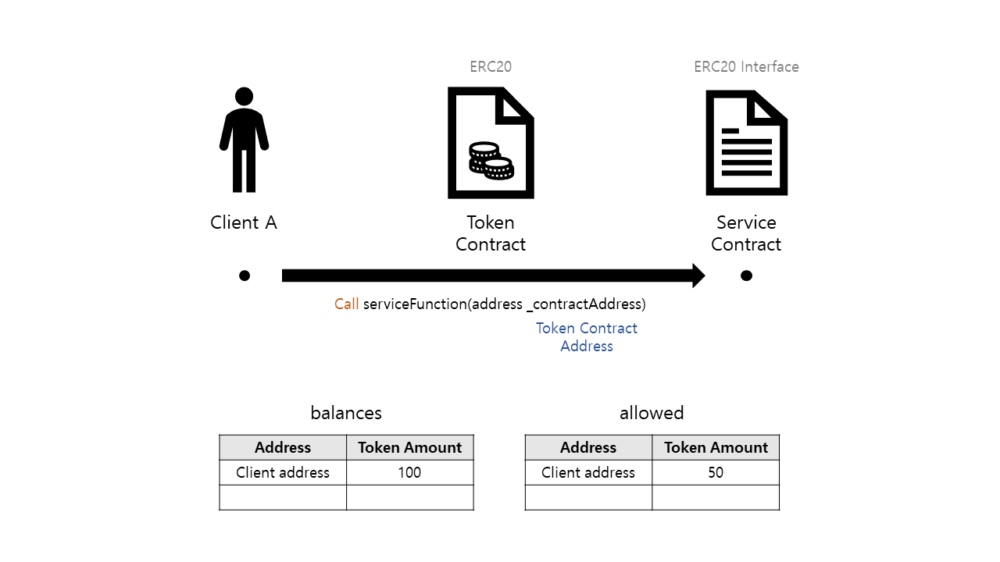
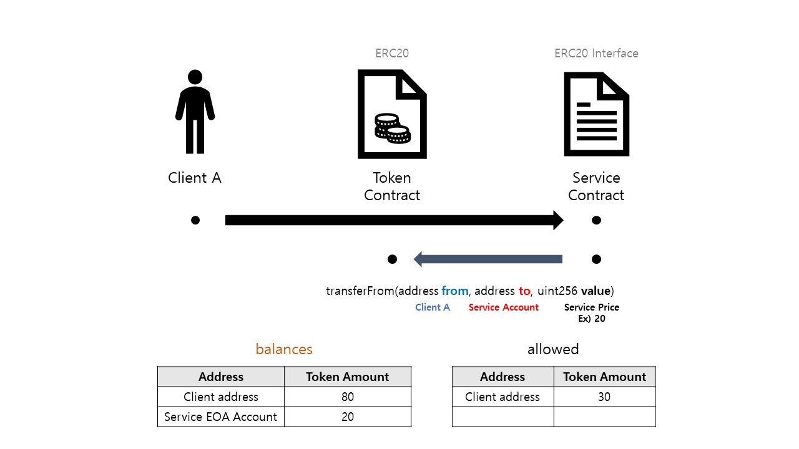
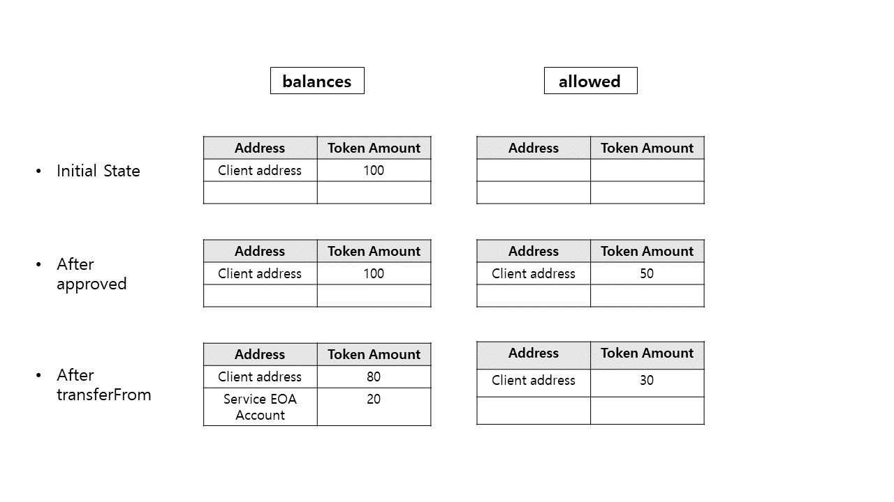

# 2장

이번 장에서는 1장에서 설명한 상황을 스마트 컨트랙트 끼리의 상호작용을 그림으로 설명할 것이다.

상호작용의 주체에는 클라이언트 A, 토큰 컨트랙트 그리고 클라이언트가 이용하고 싶어하는 서비스가 있는 서비스 컨트랙트가 있다.

이 클라이언트에게는 100이라는 토큰을 가지고 있다.
이 토큰에 관한 정보는 토큰 컨트랙트의 balances라는 매핑 구조체에 기록이 되어있다.

클라이언트가 서비스 컨트랙트의 특정 함수를 실행시키고 싶어하는데 이 함수를 실행시키려면 클라이언트 A가 가지고 있는 토큰을 서비스 컨트랙트에게 지불해야 한다.

이때 클라이언트가 할 일은 2가지다.

1. 클라이언트 A가 토큰 컨트랙트에 approve()라는 함수를 실행시킨다. **이때 approve()를 호출하는 msg.sender는 클라이언트 A가 되고**, 본인의 토큰을 가져갈 수 있는 대상인 서비스 컨트랙트의 주소와 토큰 양을 토큰 컨트랙트에게 매개변수로 전달한다.

2. 클라이언트 A가 원하는 서비스 컨트랙트의 함수를 실행시킨다. 이때 토큰 컨트랙트의 주소를 매개변수로 넘겨준다.

그러면 이제 서비스 컨트랙트가 클라이언트 A로 부터 받은 **토큰 컨트랙트의 주소** 를 이용해서 토큰 컨트랙트의 객체(instance)를 생성한다. 이 객체와 ERC20 토큰 인터페이스를 이용해서 토큰 컨트랙트 안의 함수에 접근을 한다.
주의 할 점은 이때 **생성한 객체로 함수를 호출하면 이때의 msg.sender는 서비스 컨트랙트의 주소가 된다.**

~~~Solidity
//객체 접근 예시
contract ERC20 {  
  function  transferFrom(address from, address to, uint256 value) public returns (bool);
}

contract ServiceContract{

  function doService(address _TokenContractAddress) public{
      ERC20 ercInstance = ERC20(_TokenContractAddress);

      ercInstance.transferFrom(msg.sender, address(this), 20);
      //address(this)에는 서비스 컨트랙트가 토큰을 받게 될 주소를 입력해 놓는다.

  }

}
~~~

생성된 객체로 토큰 컨트랙트의 transferFrom() 함수를 호출하고, 그 매개변수로는 doService() 함수를 호출한 클라이언트 A가 msg.sender라는 매개변수로, 토큰을 받을 주소로 address(this) 그리고 받을 토큰의 양이 들어간다.

이때 토큰을 받을 주소는 꼭 서비스 컨트랙트의 주소뿐만 아니라 서비스 컨트랙트를 배포한 사람이 코드를 작성할 시 정할 수 있다.
또한 당연히 받을 토큰의 양 또한 코드를 작성한 사람이 정할 수 있다.

> **인스턴스로 transferFrom 함수 호출시 함수를 호출하는 msg.sender는 서비스 컨트랙트 주소, transferFrom 안의 msg.sender는 클라이언트 A라는 점을 꼭 기억하길 바란다.**

그럼 잠시 토큰 컨트랙트의 transferFrom() 코드를 살펴보자.

~~~Solidity
// 할당 받은 코인을 기록하는 mapping 구조체 allowed
// 클라이언트 A가 => 서비스 컨트랙트에게 => 할당한 양에 관한 정보가 들어가 있다.
mapping (address => mapping (address => uint256)) internal allowed;

/**
 * @dev Transfer tokens from one address to another
 * @param _from address The address which you want to send tokens from
 * @param _to address The address which you want to transfer to
 * @param _value uint256 the amount of tokens to be transferred
 */
function transferFrom(address _from, address _to, uint256 _value) public returns (bool) {
  require(_to != address(0));
  require(_value <= balances[_from]);
  require(_value <= allowed[_from][msg.sender]);

  balances[_from] = balances[_from].sub(_value);
  balances[_to] = balances[_to].add(_value);
  allowed[_from][msg.sender] = allowed[_from][msg.sender].sub(_value);
  emit Transfer(_from, _to, _value);
  return true;
}
~~~

우선 위에 나와있는 transferFrom() 함수는 ERC20 컨트랙트의 인터페이스를 구현한 함수이다.
이 ERC20은 토큰 간에 상호 작용을 위해 제시된 인터페이스 제안 중 20번째로 올라온 제안이다.

이 제안을 기준으로 삼아 토큰을 제작한 토큰들은 서로간에 똑같은 함수들이 구현이 되어있을 것이다.
이러한 ERC20 기준 덕분에 토큰과 상호작용을 할 때마다 상호작용 하려는 토큰 소스 코드를 일일히 열어서 확인할 필요가 없다.

현재 가장 많이 쓰이는 토큰 ERC 기준은 ERC20이 사용되고 있다.

다시 소스로 돌아와서, 이 토큰 컨트랙트의 함수를 호출한 것은 서비스 컨트랙트이다.
즉, msg.sender는 서비스 컨트랙트의 주소일 것이다. 그리고 매개변수인 \_from 은 클라이언트 A의 주소, \_to는 서비스 컨트랙트가 돈을 받을 주소 (지금은 자기 자신) 그리고 \_value는 전송 받을 토큰 양이 될 것이다.

그럼 코드를 따라가면 먼저

- balances[]라는 토큰 양을 담고 있는 mapping 구조체에서 클라이언트 A의 토큰 개수를 \_value 개 만큼 뺀다.
- 그리고 그 뺀 양만큼 \_to로 지정된 주소에 더해준다. 이때 주소가 balances[] mapping 구조체에 없었더라면 주소를 구조체에 넣어주고 코인을 할당해 준다.
- 마지막으로 할당된 양에서 \_value 만큼 인출을 했으니 할당양을 줄이기 위해 할당양을 관리하는 mapping 구조체 allowed[]에서 allowed\[클라이언트 A가][서비스 컨트랙트에게 할당해 준] 토큰 양에서 \_value 만큼 할당을 감소한다.

이를 통해 서비스 컨트랙트는 클라이언트 A로 부터 토큰을 전송 받았다.

마지막으로 지금까지의 과정을 함수를 기준으로 3단계로 정리한 그림이다.
1. 토큰 컨트랙트의 balances[] 구조체에 클라이언트 A 주소에 토큰 100개가 있었다.
2. 클라이언트 A가 서비스 컨트랙트가 자신의 계정으로 부터 토큰 50개를 가져갈 수 있게 허락을 해 주었다.
3. 서비스 컨트랙트가 토큰 컨트랙트의 transferFrom()을 이용해 클라이언트 A가 본인에게 할당해준 토큰 양 중 20개를 가져간다.

이상으로 클라이언트, 토큰 컨트랙트 그리고 서비스 컨트랙트간의 상호작용을 그림과 코드를 통해 알아보았다.

다음 장에서는 실제 토큰 솔리디티 코드와 간단히 작성한 서비스 컨트랙트 코드를 이용해 Remix(솔리디티 IDE)에서 지금까지 한 과정을 테스트를 해 볼 것이다.
