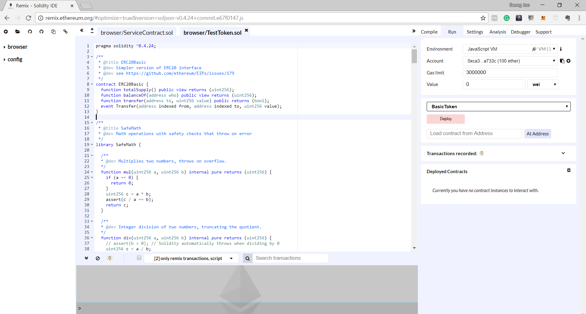
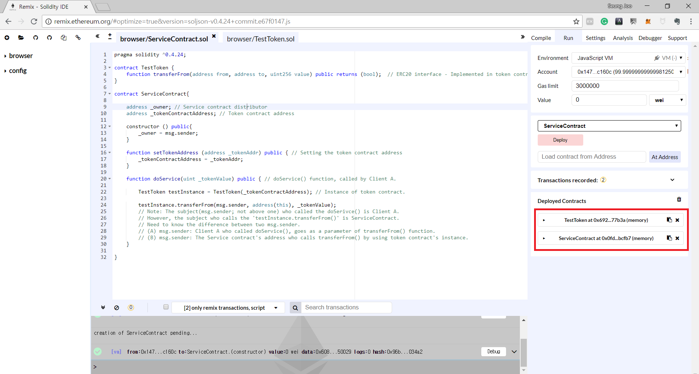
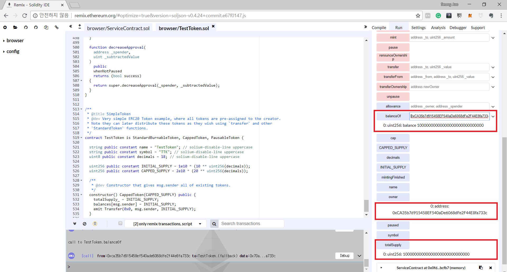
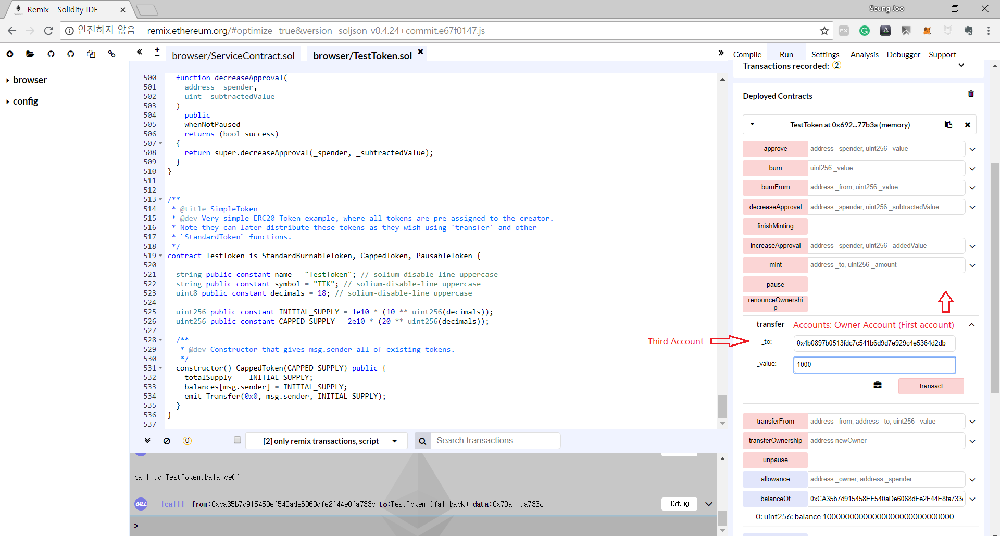
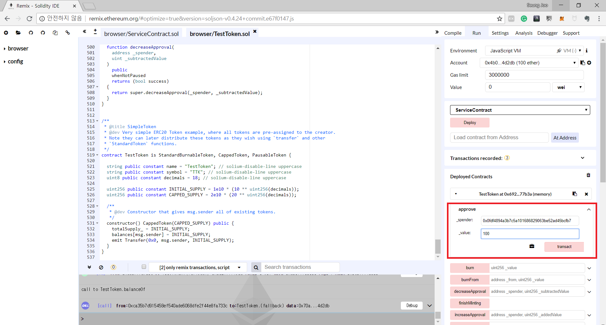
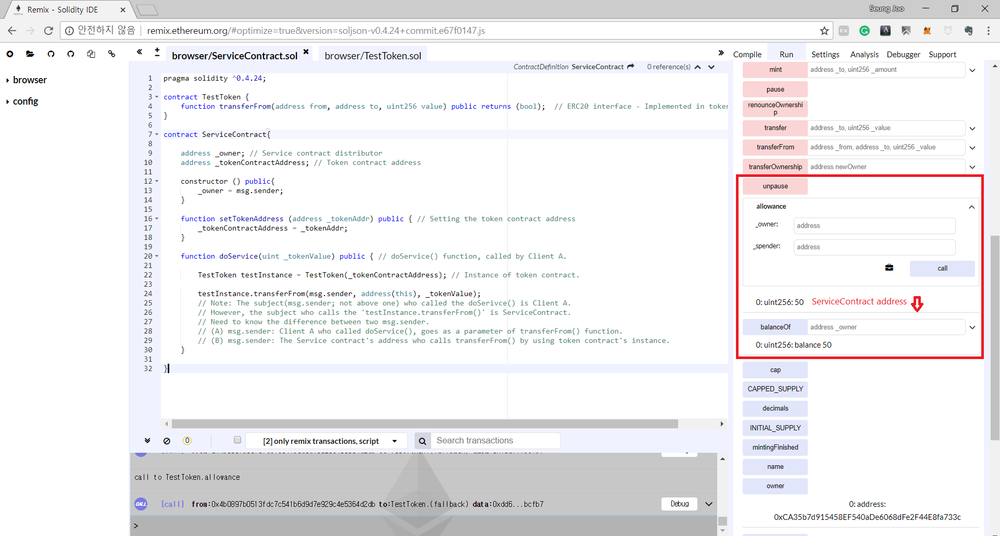

# 3장
transferFrom 실습
---

먼저 클라이언트가 이용할 서비스 컨트랙트이다.

~~~Solidity
pragma solidity ^0.4.24;

contract TestToken {
    function transferFrom(address from, address to, uint256 value) public returns (bool);  // ERC20 인터페이스 - 토큰 컨트랙트에서 구현
}

contract ServiceContract{

    address _owner; // 서비스 컨트랙트 배포자
    address _tokenContractAddress; // 지불을 받을 토큰 컨트랙트 주소

    constructor () public{
        _owner = msg.sender;
    }

    function setTokenAddress (address _tokenAddr) public { // 토큰 컨트랙트 주소 설정
        _tokenContractAddress = _tokenAddr;
    }

    function doService(uint _tokenValue) public { // 클라이언트가 이용할 doSerivce 함수 - 이 함수를 이용하기 위해서 토큰을 이 스마트 컨트랙트 주소로 보내야 한다.

        TestToken testInstance = TestToken(_tokenContractAddress); // 토큰 컨트랙트의 함수들을 호출하기 위해 토큰 컨트랙트의 객체 생성

        testInstance.transferFrom(msg.sender, address(this), _tokenValue);  
        // 여기서 알아둬야 할 점은 doService()를 호출한 msg.sender는 클라이언트 A이다.
        // 그러나 testInstance.transferFrom()을 호출하는 주체는 이 서비스 컨트랙트이다.
        // 이 두 msg.sender의 차이점을 잘 알아야 한다.
        // (A) msg.sender: doService() 함수를 호출한 클라이언트 A, transferFrom 함수의 매개변수 msg.sender에 들어간다.
        // (B) msg.sender: 토큰 컨트랙트의 transferFrom() 함수를 토큰 객체를 이용해 호출한 서비스 컨트랙트 주소 - 토큰 컨트랙트 입장에서 transferFrom()을 부른 주소는 서비스 컨트랙트 주소이다.
    }

}
~~~

서비스 컨트랙트에 대한 자세한 설명은 소스 코드 주석에 다 나와있다.
이중에서 가장 핵심이 되는 부분은 doService()를 부르는 msg.sender와 토큰의 객체를 생성해서 transferFrom()을 호출하는 msg.sender의 차이이다.

doService()를 부르는 msg.sender는 당연히 클라이언트 A가 된다 - transferFrom() 안에 msg.sender라는 매개변수로서 들어간다.

그러나 transferFrom을 부르는 msg.sender는 (transferFrom의 매개변수로 들어간 msg.sender가 아니다) 서비스 컨트랙트 주소이다.
즉, 토큰 컨트랙트 입장에서는 transferFrom()을 호출하는 msg.sender는 서비스 컨트랙트 주소이다.

이 차이를 제대로 이해하는 것이 중요하기에 계속해서 설명한 것이다.

자 그럼 이제 우리가 임시로 배포할 테스트 토큰의 소스를 볼 것인데 그 중에서 우리가 이용할 approve()와 transferFrom() 함수부터 먼저 보도록 하겠다.

~~~Solidity
// msg.sender의 돈을 _spender가 _value만큼 가져갈 수 있게 허락해 주는 함수

function approve(address _spender, uint256 _value) public returns (bool) {
  allowed[msg.sender][_spender] = _value;
  emit Approval(msg.sender, _spender, _value);
  return true;
}
~~~

approve() 함수는 크게 어려운 함수가 아니다.
allowed[msg.sender가][_spender에게] = \_value만큼 토큰을 가져갈 수 있게 허락해 주는 함수이다.
앞에서도 말했지만 컨트랙트에 토큰을 보내는 순서는

1. 서비스 컨트랙트가 클라이언트 A의 토큰을 가져가기 위해서는 먼저 클라이언트가 서비스 컨트랙트에게 토큰을 가져갈 수 있게 할당을 해주고
2. 클라이언트 A가 서비스 컨트랙트의 함수를 이용하면 transferFrom() 함수를 이용해 클라이언트 A로 부터 서비스 컨트랙트가 정한 토큰의 양만큼 가져온다.

다음으로 transferFrom() 함수 코드이다.

~~~Solidity
// 아래 함수에 매개변수로 우리는 transferFrom(클라이언트 A (msg.sender), 서비스 컨트랙트 주소 (address(this)), 토큰 양 (_tokenValue))을 주었다.
// 여기서 다시 말하지만 transferFrom()을 호출한 msg.sender는 서비스 컨트랙트 주소이다.

function transferFrom(address _from, address _to, uint256 _value) public returns (bool) {
  emit whoIsTheMessageSender(msg.sender, "Invoked from ERC20 Token itself"); // msg.sender는 서비스 컨트랙트 주소

  require(_to != address(0));
  require(_value <= balances[_from]); // 돈을 전송받을 _from(클라이언트 A)의 토큰이 전송할 양보다 많이 있어야 한다.
  require(_value <= allowed[_from][msg.sender]); // allowed[클라이언트 A가][서비스 컨트랙트] 에게 허락해준 토큰 양

  balances[_from] = balances[_from].sub(_value); // 클라이언트 A의 토큰 양을 지불할 양만큼 감소시킨다.
  balances[_to] = balances[_to].add(_value); // 서비스 컨트랙트의 토큰 양을 지불 받은 양만큼 증가시킨다.
  allowed[_from][msg.sender] = allowed[_from][msg.sender].sub(_value); // 클라이언트 A가 서비스 컨트랙트에게 허락해 준 양을 지불된 양만큼 감소시킨다.
  emit Transfer(_from, _to, _value);
  return true;
}
~~~

transferFrom()은 msg.sender가 \_from으로 부터 할당을 받은 토큰을 \_to (여기서는 서비스 컨트랙트 address(this))에게 \_value만큼 보낸다.
여기서 transferFrom을 호출한 msg.sender는 서비스 컨트랙트이다. 클라이언트 A는 \_from 매개 변수로서 들어오게 된다.

자 그럼 이제 클라이언트 A가 서비스 컨트랙트에게 approve()로 토큰을 할당해주고 서비스 컨트랙트의 함수를 통해 할당된 토큰을 가져오는 실습을 진행해 보겠다.

먼저 리믹스에서 각각 TestToken.sol 파일과 ServiceContract.sol 파일을 생성하고 각각의 파일에 아래 솔리디티 코드를 붙여넣는다.

### ServiceContract.sol

~~~Solidity
pragma solidity ^0.4.24;

contract TestToken {
    function transferFrom(address from, address to, uint256 value) public returns (bool);  // ERC20 인터페이스 - 토큰 컨트랙트에서 구현
}

contract ServiceContract{

    address _owner; // 서비스 컨트랙트 배포자
    address _tokenContractAddress; // 지불을 받을 토큰 컨트랙트 주소

    constructor () public{
        _owner = msg.sender;
    }

    function setTokenAddress (address _tokenAddr) public { // 지불을 받을 토큰 컨트랙트 주소 설정
        _tokenContractAddress = _tokenAddr;
    }

    function doService(uint _tokenValue) public { // 클라이언트가 이용할 doSerivce 함수 - 이 함수를 이용하기 위해서 토큰을 이 스마트 컨트랙트 주소로 보내야 한다.

        TestToken testInstance = TestToken(_tokenContractAddress); // 토큰 컨트랙트의 함수들을 호출하기 위해 토큰 컨트랙트의 객체 생성

        testInstance.transferFrom(msg.sender, address(this), _tokenValue);  
        // 여기서 알아둬야 할 점은 doService()를 호출한 msg.sender는 클라이언트 A이다.
        // 그러나 testInstance.transferFrom()을 호출하는 주체는 이 서비스 컨트랙트이다.
        // 이 두 msg.sender의 차이점을 잘 알아야 한다.
        // (A) msg.sender: doService() 함수를 호출한 클라이언트 A, transferFrom 함수의 매개변수 msg.sender에 들어간다.
        // (B) msg.sender: 토큰 컨트랙트의 transferFrom() 함수를 토큰 객체를 이용해 호출한 서비스 컨트랙트 주소 - 토큰 컨트랙트 입장에서 transferFrom()을 부른 주소는 서비스 컨트랙트 주소이다.
    }

}
~~~

 

### TestToken.sol

~~~Solidity
pragma solidity ^0.4.24;

/**
 * @title ERC20Basic
 * @dev Simpler version of ERC20 interface
 * @dev see https://github.com/ethereum/EIPs/issues/179
 */
contract ERC20Basic {
  function totalSupply() public view returns (uint256);
  function balanceOf(address who) public view returns (uint256);
  function transfer(address to, uint256 value) public returns (bool);
  event Transfer(address indexed from, address indexed to, uint256 value);
}

/**
 * @title SafeMath
 * @dev Math operations with safety checks that throw on error
 */
library SafeMath {

  /**
  * @dev Multiplies two numbers, throws on overflow.
  */
  function mul(uint256 a, uint256 b) internal pure returns (uint256) {
    if (a == 0) {
      return 0;
    }
    uint256 c = a * b;
    assert(c / a == b);
    return c;
  }

  /**
  * @dev Integer division of two numbers, truncating the quotient.
  */
  function div(uint256 a, uint256 b) internal pure returns (uint256) {
    // assert(b > 0); // Solidity automatically throws when dividing by 0
    uint256 c = a / b;
    // assert(a == b * c + a % b); // There is no case in which this doesn't hold
    return c;
  }

  /**
  * @dev Subtracts two numbers, throws on overflow (i.e. if subtrahend is greater than minuend).
  */
  function sub(uint256 a, uint256 b) internal pure returns (uint256) {
    assert(b <= a);
    return a - b;
  }

  /**
  * @dev Adds two numbers, throws on overflow.
  */
  function add(uint256 a, uint256 b) internal pure returns (uint256) {
    uint256 c = a + b;
    assert(c >= a);
    return c;
  }
}

/**
 * @title Basic token
 * @dev Basic version of StandardToken, with no allowances.
 */
contract BasicToken is ERC20Basic {
  using SafeMath for uint256;

  mapping(address => uint256) balances;

  uint256 totalSupply_;

  /**
  * @dev total number of tokens in existence
  */
  function totalSupply() public view returns (uint256) {
    return totalSupply_;
  }

  /**
  * @dev transfer token for a specified address
  * @param _to The address to transfer to.
  * @param _value The amount to be transferred.
  */
  function transfer(address _to, uint256 _value) public returns (bool) {
    require(_to != address(0));
    require(_value <= balances[msg.sender]);

    // SafeMath.sub will throw if there is not enough balance.
    balances[msg.sender] = balances[msg.sender].sub(_value);
    balances[_to] = balances[_to].add(_value);
    emit Transfer(msg.sender, _to, _value);
    return true;
  }

  /**
  * @dev Gets the balance of the specified address.
  * @param _owner The address to query the the balance of.
  * @return An uint256 representing the amount owned by the passed address.
  */
  function balanceOf(address _owner) public view returns (uint256 balance) {
    return balances[_owner];
  }
}

/**
 * @title ERC20 interface
 * @dev see https://github.com/ethereum/EIPs/issues/20
 */
contract ERC20 is ERC20Basic {
  function allowance(address owner, address spender) public view returns (uint256);
  function transferFrom(address from, address to, uint256 value) public returns (bool);
  function approve(address spender, uint256 value) public returns (bool);
  event Approval(address indexed owner, address indexed spender, uint256 value);
}

/**
 * @title Standard ERC20 token
 *
 * @dev Implementation of the basic standard token.
 * @dev https://github.com/ethereum/EIPs/issues/20
 * @dev Based on code by FirstBlood: https://github.com/Firstbloodio/token/blob/master/smart_contract/FirstBloodToken.sol
 */
contract StandardToken is ERC20, BasicToken {

  mapping (address => mapping (address => uint256)) internal allowed;

  /**
   * @dev Transfer tokens from one address to another
   * @param _from address The address which you want to send tokens from
   * @param _to address The address which you want to transfer to
   * @param _value uint256 the amount of tokens to be transferred
   */
  function transferFrom(address _from, address _to, uint256 _value) public returns (bool) {
    require(_to != address(0));
    require(_value <= balances[_from]);
    require(_value <= allowed[_from][msg.sender]);

    balances[_from] = balances[_from].sub(_value);
    balances[_to] = balances[_to].add(_value);
    allowed[_from][msg.sender] = allowed[_from][msg.sender].sub(_value);
    emit Transfer(_from, _to, _value);
    return true;
  }

  /**
   * @dev Approve the passed address to spend the specified amount of tokens on behalf of msg.sender.
   *
   * Beware that changing an allowance with this method brings the risk that someone may use both the old
   * and the new allowance by unfortunate transaction ordering. One possible solution to mitigate this
   * race condition is to first reduce the spender's allowance to 0 and set the desired value afterwards:
   * https://github.com/ethereum/EIPs/issues/20#issuecomment-263524729
   * @param _spender The address which will spend the funds.
   * @param _value The amount of tokens to be spent.
   */
  function approve(address _spender, uint256 _value) public returns (bool) {
    allowed[msg.sender][_spender] = _value;
    emit Approval(msg.sender, _spender, _value);
    return true;
  }

  /**
   * @dev Function to check the amount of tokens that an owner allowed to a spender.
   * @param _owner address The address which owns the funds.
   * @param _spender address The address which will spend the funds.
   * @return A uint256 specifying the amount of tokens still available for the spender.
   */
  function allowance(address _owner, address _spender) public view returns (uint256) {
    return allowed[_owner][_spender];
  }

  /**
   * @dev Increase the amount of tokens that an owner allowed to a spender.
   *
   * approve should be called when allowed[_spender] == 0. To increment
   * allowed value is better to use this function to avoid 2 calls (and wait until
   * the first transaction is mined)
   * From MonolithDAO Token.sol
   * @param _spender The address which will spend the funds.
   * @param _addedValue The amount of tokens to increase the allowance by.
   */
  function increaseApproval(address _spender, uint _addedValue) public returns (bool) {
    allowed[msg.sender][_spender] = allowed[msg.sender][_spender].add(_addedValue);
    emit Approval(msg.sender, _spender, allowed[msg.sender][_spender]);
    return true;
  }

  /**
   * @dev Decrease the amount of tokens that an owner allowed to a spender.
   *
   * approve should be called when allowed[_spender] == 0. To decrement
   * allowed value is better to use this function to avoid 2 calls (and wait until
   * the first transaction is mined)
   * From MonolithDAO Token.sol
   * @param _spender The address which will spend the funds.
   * @param _subtractedValue The amount of tokens to decrease the allowance by.
   */
  function decreaseApproval(address _spender, uint _subtractedValue) public returns (bool) {
    uint oldValue = allowed[msg.sender][_spender];
    if (_subtractedValue > oldValue) {
      allowed[msg.sender][_spender] = 0;
    } else {
      allowed[msg.sender][_spender] = oldValue.sub(_subtractedValue);
    }
    emit Approval(msg.sender, _spender, allowed[msg.sender][_spender]);
    return true;
  }
}

/**
 * @title Ownable
 * @dev The Ownable contract has an owner address, and provides basic authorization control
 * functions, this simplifies the implementation of "user permissions".
 */
contract Ownable {
  address public owner;

  event OwnershipRenounced(address indexed previousOwner);
  event OwnershipTransferred(
    address indexed previousOwner,
    address indexed newOwner
  );

  /**
   * @dev The Ownable constructor sets the original `owner` of the contract to the sender
   * account.
   */
  constructor() public {
    owner = msg.sender;
  }

  /**
   * @dev Throws if called by any account other than the owner.
   */
  modifier onlyOwner() {
    require(msg.sender == owner);
    _;
  }

  /**
   * @dev Allows the current owner to transfer control of the contract to a newOwner.
   * @param newOwner The address to transfer ownership to.
   */
  function transferOwnership(address newOwner) public onlyOwner {
    require(newOwner != address(0));
    emit OwnershipTransferred(owner, newOwner);
    owner = newOwner;
  }

  /**
   * @dev Allows the current owner to relinquish control of the contract.
   */
  function renounceOwnership() public onlyOwner {
    emit OwnershipRenounced(owner);
    owner = address(0);
  }
}

/**
 * @title Burnable Token
 * @dev Token that can be irreversibly burned (destroyed).
 */
contract BurnableToken is BasicToken {

  event Burn(address indexed burner, uint256 value);

  /**
   * @dev Burns a specific amount of tokens.
   * @param _value The amount of token to be burned.
   */
  function burn(uint256 _value) public {
    _burn(msg.sender, _value);
  }

  function _burn(address _who, uint256 _value) internal {
    require(_value <= balances[_who]);
    // no need to require value <= totalSupply, since that would imply the
    // sender's balance is greater than the totalSupply, which *should* be an assertion failure

    balances[_who] = balances[_who].sub(_value);
    totalSupply_ = totalSupply_.sub(_value);
    emit Burn(_who, _value);
    emit Transfer(_who, address(0), _value);
  }
}

/**
 * @title Standard Burnable Token
 * @dev Adds burnFrom method to ERC20 implementations
 */
contract StandardBurnableToken is BurnableToken, StandardToken {

  /**
   * @dev Burns a specific amount of tokens from the target address and decrements allowance
   * @param _from address The address which you want to send tokens from
   * @param _value uint256 The amount of token to be burned
   */
  function burnFrom(address _from, uint256 _value) public {
    require(_value <= allowed[_from][msg.sender]);
    // Should https://github.com/OpenZeppelin/zeppelin-solidity/issues/707 be accepted,
    // this function needs to emit an event with the updated approval.
    allowed[_from][msg.sender] = allowed[_from][msg.sender].sub(_value);
    _burn(_from, _value);
  }
}

/**
 * @title Mintable token
 * @dev Simple ERC20 Token example, with mintable token creation
 * @dev Issue: * https://github.com/OpenZeppelin/openzeppelin-solidity/issues/120
 * Based on code by TokenMarketNet: https://github.com/TokenMarketNet/ico/blob/master/contracts/MintableToken.sol
 */
contract MintableToken is StandardToken, Ownable {
  event Mint(address indexed to, uint256 amount);
  event MintFinished();

  bool public mintingFinished = false;

  modifier canMint() {
    require(!mintingFinished);
    _;
  }

  modifier hasMintPermission() {
    require(msg.sender == owner);
    _;
  }

  /**
   * @dev Function to mint tokens
   * @param _to The address that will receive the minted tokens.
   * @param _amount The amount of tokens to mint.
   * @return A boolean that indicates if the operation was successful.
   */
  function mint(
    address _to,
    uint256 _amount
  )
    hasMintPermission
    canMint
    public
    returns (bool)
  {
    totalSupply_ = totalSupply_.add(_amount);
    balances[_to] = balances[_to].add(_amount);
    emit Mint(_to, _amount);
    emit Transfer(address(0), _to, _amount);
    return true;
  }

  /**
   * @dev Function to stop minting new tokens.
   * @return True if the operation was successful.
   */
  function finishMinting() onlyOwner canMint public returns (bool) {
    mintingFinished = true;
    emit MintFinished();
    return true;
  }
}

/**
 * @title Capped token
 * @dev Mintable token with a token cap.
 */
contract CappedToken is MintableToken {

  uint256 public cap;

  constructor(uint256 _cap) public {
    require(_cap > 0);
    cap = _cap;
  }

  /**
   * @dev Function to mint tokens
   * @param _to The address that will receive the minted tokens.
   * @param _amount The amount of tokens to mint.
   * @return A boolean that indicates if the operation was successful.
   */
  function mint(
    address _to,
    uint256 _amount
  )
    onlyOwner
    canMint
    public
    returns (bool)
  {
    require(totalSupply_.add(_amount) <= cap);

    return super.mint(_to, _amount);
  }

}

/**
 * @title Pausable
 * @dev Base contract which allows children to implement an emergency stop mechanism.
 */
contract Pausable is Ownable {
  event Pause();
  event Unpause();

  bool public paused = false;

  /**
   * @dev Modifier to make a function callable only when the contract is not paused.
   */
  modifier whenNotPaused() {
    require(!paused);
    _;
  }

  /**
   * @dev Modifier to make a function callable only when the contract is paused.
   */
  modifier whenPaused() {
    require(paused);
    _;
  }

  /**
   * @dev called by the owner to pause, triggers stopped state
   */
  function pause() onlyOwner whenNotPaused public {
    paused = true;
    emit Pause();
  }

  /**
   * @dev called by the owner to unpause, returns to normal state
   */
  function unpause() onlyOwner whenPaused public {
    paused = false;
    emit Unpause();
  }
}

/**
 * @title Pausable token
 * @dev StandardToken modified with pausable transfers.
 **/
contract PausableToken is StandardToken, Pausable {

  function transfer(
    address _to,
    uint256 _value
  )
    public
    whenNotPaused
    returns (bool)
  {
    return super.transfer(_to, _value);
  }

  function transferFrom(
    address _from,
    address _to,
    uint256 _value
  )
    public
    whenNotPaused
    returns (bool)
  {
    return super.transferFrom(_from, _to, _value);
  }

  function approve(
    address _spender,
    uint256 _value
  )
    public
    whenNotPaused
    returns (bool)
  {
    return super.approve(_spender, _value);
  }

  function increaseApproval(
    address _spender,
    uint _addedValue
  )
    public
    whenNotPaused
    returns (bool success)
  {
    return super.increaseApproval(_spender, _addedValue);
  }

  function decreaseApproval(
    address _spender,
    uint _subtractedValue
  )
    public
    whenNotPaused
    returns (bool success)
  {
    return super.decreaseApproval(_spender, _subtractedValue);
  }
}

/**
 * @title SimpleToken
 * @dev Very simple ERC20 Token example, where all tokens are pre-assigned to the creator.
 * Note they can later distribute these tokens as they wish using `transfer` and other
 * `StandardToken` functions.
 */
contract MyToken is StandardBurnableToken, CappedToken, PausableToken {

  string public constant name = "MyToken"; // solium-disable-line uppercase
  string public constant symbol = "MTK"; // solium-disable-line uppercase
  uint8 public constant decimals = 18; // solium-disable-line uppercase

  uint256 public constant INITIAL_SUPPLY = 1e10 * (10 ** uint256(decimals));
  uint256 public constant CAPPED_SUPPLY = 2e10 * (20 ** uint256(decimals));

  /**
   * @dev Constructor that gives msg.sender all of existing tokens.
   */
  constructor() CappedToken(CAPPED_SUPPLY) public {
    totalSupply_ = INITIAL_SUPPLY;
    balances[msg.sender] = INITIAL_SUPPLY;
    emit Transfer(0x0, msg.sender, INITIAL_SUPPLY);
  }
}

~~~

각각의 솔리디티 코드로 성공적으로 sol 파일을 생성했다면 다음과 같은 화면을 볼 수 있을 것이다.

그럼 먼저 Run 텝에 들어가 Environment를 JavaScript VM으로 설정을 해주자.

그 다음 TestToken.sol 파일을 클릭하고 Compile 텝에 들어가서 Start to compile 또는 Ctrl + s를 눌러 컴파일을 해주자.

성공적으로 컴파일이 되었다면 초록색 박스로 TestToken 안에 작성된 각각의 Contract 들이 나올것이다.

그럼 Run 텝에 들어가 드롭 다운 메뉴에서 TestToken을 선택하고 Deploy 버튼을 눌러 컨트랙트를 배포를 하자.

그럼 배포시 선택이 되었던 Account의 계좌(여기서는 첫번째 계좌)에서 컨트랙트 배포 비용으로 소량의 wei가 지불이 되고

Deployed Contracts에서 TestToken이라는 이름과 주소가 나와있는 것을 볼 수 있을 것이다.

자 그럼 이제 TestToken의 컨트랙트가 배포되었으니 이제 ServiceContract.sol을 선택을 하자.

그리고 ServiceContract.sol을 컴파일 (Ctrl + s) 하면 이제 드롭 다운 메뉴에 ServiceContract가 뜰 것이다.

이번에는 Account를 2번째 계정을 선택하고 Deploy 버튼을 누르자.

> Compile을 하게 되면 Account에 대한 정보는 초기화 된다. 아까 TestToken을 배포했던 계정의 이더양도 초기화가 되어있을 것이다. 그러나 TestToken을 배포한 계정은 첫번째 계정이라는 정보는 변하지 않는다.

그럼 이제 2번째 계정의 wei가 차감되고 ServiceContract가 배포가 된다.

여기까지 성공적으로 작동이 되었다면 아래와 같은 화면을 볼 수 있을 것이다.

그럼 이제 배포된 TestToken을 클릭해 보자.

그럼 TestToken에서 작성된 각종 함수들이 나올 것이다.

그 중에서 owner와 totalSupply 함수를 클릭해보자. 그럼 각각 컨트랙트를 배포한 주소 (첫번째 계정)과
10000000000000000000000000000이라는 총 발행량이 나올것이다.

이 토큰 컨트랙트에서는 이 총 발행량은 전부 owner가 가지고 있게 된다.
이를 확인하기 위해 balanceOf 함수에 컨트랙트를 배포한 계정 주소를 넣어보면 총 발행량과 같은 숫자가 나올 것이다.

그럼 이제 클라이언트 A에 대한 설정을 해주겠다.

Accounts 중에 우리는 3번째 계정을 클라이언트 A로 설정할 것이다.

먼저 계정 3번에는 아직까지 아무런 토큰이 없기 때문에 토큰 컨트랙트의 owner(첫번째 계정)이 클라이언트 A(3번째 계정)에게 1000 정도의 토큰을 보내주겠다.

Accounts에서 3번째 계정을 선택해 주소를 복사하고 다시 1번째 계정을 선택해 transfer 함수를 이용해 1000 만큼의 토큰을 전송하겠다.

성공적으로 transfer가 되었다면 balanceOf를 통해 3번째 계정의 토큰 수를 확인하면 1000개가 있는 것을 확인할 수 있을 것이다.

자 그럼 이제 클라이언트 A가 ServiceContract에게 본인의 토큰을 할당해 줄 차례다.

Accounts에서 3번째 계정을 선택을 하고 ServiceContract의 주소를 복사를 하자.
그리고 TestToken 컨트랙트의 함수 중 approve 함수에 ServiceContract 주소와 할당해 줄 양 (이번에는 100개를 할당해 주겠다)을 입력하고 호출을 하자.

성공적으로 ServiceContract에 할당이 되었는지 확인을 하고 싶으면 allowance 함수에 3번째 계정 주소와 ServiceContract 주소를 입력해 호출하면 우리가 할당해 준 양이 나올 것이다.

자 그럼 이제 ServiceContract의 doService 함수를 이용할 차례다.

먼저 ServiceContract에서 사용할 토큰의 instance를 설정하기 위해 setTokenAddress 함수에 우리가 배포한 TestToken 주소를 입력하고 호출하자.

그럼 이제 ServiceContract에서 TestToken의 함수들을 호출할 수 있게 되었다.

자 그럼 이제 클라이언트 A가 doService 함수를 이용할 차례이다.

> 원래라면 이런 doService를 하기 위해 지불되어야 하는 토큰의 개수등은 ServiceContract를 배포한 사람이 미리 설정을 해놓겠지만 우리는 테스트를 위해 우리가 직접
지불할 토큰의 양을 정해 doService 함수를 호출 하겠다.

doService를 이용할 때 지불할 토큰의 양으로 50만큼을 지불한다고 가정하고 50을 입력하겠다.
그럼 doService 함수 안에서 아래의 코드가 실행 될 것이다.

~~~Solidity
testInstance.transferFrom(msg.sender, address(this), _tokenValue);  
~~~

그럼 이를 통해 ServiceContract의 컨트랙트 주소에 50 만큼의 토큰이 전송이 됬을 것이다.

이를 확인하기 위해 TestToken 컨트랙트에서 balanceOf 함수에 ServiceContract 주소를 입력해 보면 50 만큼의 양이 있는 것을 확인할 수 있다.
그리고 allowance에 계정 3번과 ServiceContract의 주소를 입력하면 아까 100만큼의 할당을 한 것에서 50만큼을 사용했기 때문에 아직 할당양이 50만큼 남아있는 것을 볼 수 있다.

이상으로 approve와 transferFrom에 대해 알아보았다.

부디 이 글이 ERC20 토큰 사용에 대한 이해에 도움이 되었으면 한다.
